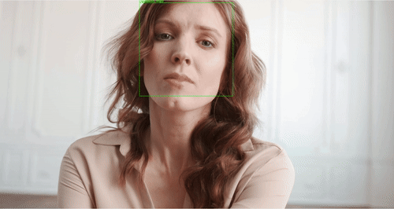
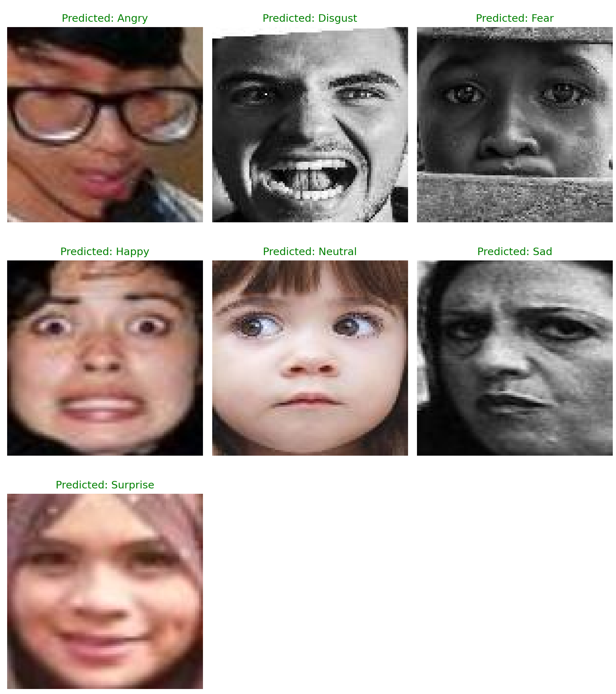

# Facial Expression Recognition with DDAMFN  
**Dual Dynamic Attention Mixed Feature Network**

## 📌 Overview
This repository contains the implementation of **DDAMFN (Dual Dynamic Attention Mixed Feature Network)** for **Facial Expression Recognition (FER)** using PyTorch.

The project explores how **attention mechanisms and mixed feature representations** can improve emotion recognition accuracy from facial images.  
It supports both **offline inference** and **real-time webcam-based emotion detection**.

This repository contains **code only**.  
Datasets and pretrained models are hosted externally.

---

## 🎯 Key Features
- Custom attention-based CNN architecture (DDAMFN)
- Modular PyTorch implementation
- Support for standard FER datasets (RAF-DB, FER+)
- Real-time facial expression recognition via webcam
- Clean and reproducible project structure

---
## Demo

### Real-time demo (GIF)


### Sample output



## 🧠 Model Architecture
DDAMFN integrates:
- mixed low-level and high-level facial feature extraction
- dual dynamic attention blocks
- efficient CNN design suitable for real-time inference

Model components are implemented under the `networks/` directory.

---

## 📂 Project Structure
```

FACIAL_EXPRESSION_RECOGNITION/
│
├── networks/              # Model architecture and attention modules
├── affectnet/             # Dataset utilities (if applicable)
├── ferPlus/               # FER+ helpers
│
├── facial_recognition.py  # Image / video inference
├── real_time.py           # Real-time webcam demo
├── merger2.0.py           # Feature / model merging utilities
│
├── README.md
├── requirements.txt
└── .gitignore

````

---

## 📊 Supported Datasets
This project is designed to work with commonly used FER datasets:
- RAF-DB
- FER+

⚠️ Datasets are **not included** due to license and size constraints.

---

## ⚙️ Installation

### 1️⃣ Clone the repository
```bash
git clone https://github.com/imdiora/FACIAL_EXPRESSION_RECOGNITION.git
cd FACIAL_EXPRESSION_RECOGNITION
````

### 2️⃣ Create a virtual environment

```bash
python -m venv venv
source venv/bin/activate      # macOS / Linux
venv\Scripts\activate         # Windows
```

### 3️⃣ Install dependencies

```bash
pip install -r requirements.txt
```

---

## ▶️ Usage

### 🔹 Run inference on images / video

```bash
python facial_recognition.py
```

### 🔹 Run real-time webcam demo

```bash
python real_time.py
```

---

## 📦 Pretrained Models

Pretrained DDAMFN weights are hosted on **Hugging Face**:

👉 [https://huggingface.co/YOUR_USERNAME/ddamfn-facial-expression-recognition](https://huggingface.co/YOUR_USERNAME/ddamfn-facial-expression-recognition)

### Usage

1. Download the pretrained model file
2. Create a folder named `pretrained/`
3. Place the model file inside it

```
pretrained/
 └── ddamfn_rafdb_best.pth
```

---

## 🧪 Training

Training scripts and dataset loaders are included for experimentation and fine-tuning.
Ensure dataset paths are configured correctly before training.

---

## 🚀 Applications

* Facial emotion recognition
* Human–computer interaction
* Affective computing
* Emotion-aware real-time systems

---

## 🛠️ Tech Stack

* Python
* PyTorch
* OpenCV
* NumPy
* Deep Learning & Attention Models

---

## 📌 Notes

* Large files (datasets, checkpoints, environments) are intentionally excluded
* Designed for research, experimentation, and portfolio use
* Follows industry-standard ML project structuring

---

## 📄 License

This project is intended for **educational and research purposes**.
Please verify dataset licenses before any commercial use.

---

## 👩‍💻 Author

**Diyora Bobokulova**
Computer Engineering | AI Automation & Computer Vision

GitHub: [https://github.com/imdiora](https://github.com/imdiora)
Hugging Face: [https://huggingface.co/imdiora/ddamfn-facial-expression-recognition](https://huggingface.co/imdiora/ddamfn-facial-expression-recognition)

Thanks to [Jamshid Ganiev](https://github.com/Jamshid-Ganiev) for major help with backend logic and debugging.
